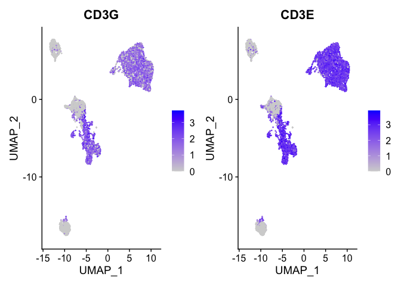
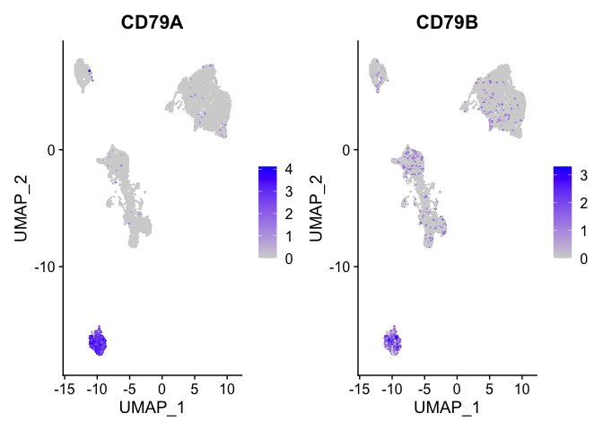
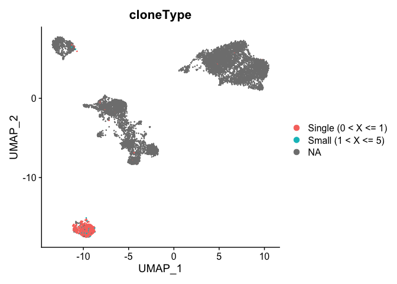

Last Updated March 25, 2021

# Single Cell V(D)J Analysis with Seurat and some custom code!

[Seurat](http://satijalab.org/seurat/) is a popular R package that is designed for QC, analysis, and exploration of single cell data. Seurat aims to enable users to identify and interpret sources of heterogeneity from single cell transcriptomic measurements, and to integrate diverse types of single cell data. Further, the authors provide several [tutorials](https://satijalab.org/seurat/vignettes.html) on their website.


We start with loading needed libraries for R

**Matt says we don't need all the libraries**


```r
library(Seurat)
library(ggplot2)
library(knitr)
# I like this package
library(kableExtra)
library(cowplot)
library(dplyr)
library(circlize)
library(scales)
library(scRepertoire)
```

## Load the Expression Matrix Data and create the combined base Seurat object.

Seurat provides a function `Read10X` to read in 10X data folder. First we read in data from each individual sample folder. Then, we initialize the Seurat object (`CreateSeuratObject`) with the raw (non-normalized data). Keep all genes expressed in >= 3 cells. Keep all cells with at least 200 detected genes. Also extracting sample names, calculating and adding in the metadata mitochondrial percentage of each cell. Some QA/QC Finally, saving the raw Seurat object.


### Setup the experiment folder and data info

```r
experiment_name = "Covid VDJ Example"
dataset_loc <- "./advsinglecellvdj_March2021"
ids <- c("T021PBMC", "T022PBMC")
ids
```

```
## [1] "T021PBMC" "T022PBMC"
```

###1. Load the Cell Ranger Matrix Data (hdf5 file) and create the base Seurat object.

```r
d10x.data <- lapply(ids, function(i){
  d10x <- Read10X_h5(file.path(dataset_loc,paste0(i,"_Counts/outs"),"raw_feature_bc_matrix.h5"))
  colnames(d10x) <- paste(sapply(strsplit(colnames(d10x),split="-"),'[[',1L),i,sep="-")
  d10x
})

names(d10x.data) <- ids
```

###2. Create the Seurat object

filter criteria: remove genes that do not occur in a minimum of 0 cells and remove cells that don't have a minimum of 200 features


```r
experiment.data <- do.call("cbind", d10x.data)

experiment.aggregate <- CreateSeuratObject(
  experiment.data,
  project = experiment_name,
  min.cells = 0,
  min.features = 300,
  names.field = 2,
  names.delim = "\\-")

experiment.aggregate
```

```
## An object of class Seurat 
## 36601 features across 13398 samples within 1 assay 
## Active assay: RNA (36601 features, 0 variable features)
```


###3. The percentage of reads that map to the mitochondrial genome

* Low-quality / dying cells often exhibit extensive mitochondrial contamination.
* We calculate mitochondrial QC metrics with the PercentageFeatureSet function, which calculates the percentage of counts originating from a set of features.
* We use the set of all genes, in mouse these genes can be identified as those that begin with 'mt', in human data they begin with MT.


```r
experiment.aggregate$percent.mito <- PercentageFeatureSet(experiment.aggregate, pattern = "^MT-")
summary(experiment.aggregate$percent.mito)
```

```
##    Min. 1st Qu.  Median    Mean 3rd Qu.    Max. 
##   0.000   1.680   2.378   3.232   3.429  64.962
```

###4. QA/QC and filtering

```r
# Custom violinplot code
violin_custom <- function(object, var, pt.size = 0.1, pt.alpha = 0.1, log = F){
	p <- ggplot(object[[]], aes(y = !!sym(var), x = orig.ident, fill = orig.ident)) + 
	geom_violin(scale = "width", width = 0.9) + 
	geom_point(position = position_jitterdodge(dodge.width = 0.9, jitter.width = 1.4), 
		size = pt.size, alpha = pt.alpha) + 
	labs(fill = NULL, x = "Identity", y = NULL, title = var) + 	
	cowplot::theme_cowplot() + 
	theme(axis.text.x = element_text(angle = 45, hjust = 1), plot.title = element_text(hjust = 0.5))
	if (log){
		p <- p + scale_y_continuous(trans = "log10")
	}
	return(p)
}
```

#### Violin plot of genes/cell by sample:

```r
var <- "nFeature_RNA"
violin_custom(experiment.aggregate, var)
```

<div class="figure" style="text-align: center">

<p class="caption">Violin Plot of Genes/Cell by Sample</p>
</div>

#### Violin plot of nUMI by sample:

```r
var <- "nCount_RNA"
violin_custom(experiment.aggregate, var, log=T) # Try Log = T
```

<div class="figure" style="text-align: center">

<p class="caption">Violin Plot of UMI Count by Sample</p>
</div>

#### Violin plot of percent mitochondrial gene expression by sample:

```r
var <- "percent.mito"
violin_custom(experiment.aggregate, var, log=T)
```

```
## Warning: Transformation introduced infinite values in continuous y-axis

## Warning: Transformation introduced infinite values in continuous y-axis
```

```
## Warning: Removed 5 rows containing non-finite values (stat_ydensity).
```

<div class="figure" style="text-align: center">

<p class="caption">Violin Plot of Percent Mitochondrial Gene Expression by Sample</p>
</div>

### Cell filtering

We use the information above to filter out cells. Here we choose those that have percent mitochondrial genes max of 8%, unique UMI counts under 3,000 or greater than 12,000 and contain at least 1000 features within them.


```r
table(experiment.aggregate$orig.ident)
```

```
## 
## T021PBMC T022PBMC 
##     8310     5088
```

```r
experiment.aggregate <- subset(experiment.aggregate, percent.mito <= 8)

experiment.aggregate <- subset(experiment.aggregate, nCount_RNA >= 3000 & nCount_RNA <= 12000)

experiment.aggregate <- subset(experiment.aggregate, nFeature_RNA >= 1000)

experiment.aggregate
```

```
## An object of class Seurat 
## 36601 features across 9889 samples within 1 assay 
## Active assay: RNA (36601 features, 0 variable features)
```

```r
table(experiment.aggregate$orig.ident)
```

```
## 
## T021PBMC T022PBMC 
##     5914     3975
```

**Qusetion** How does this filter relate to the cell ranger filtered result?


###5. Normalize the data

After filtering out cells from the dataset, the next step is to normalize the data. By default, we employ a global-scaling normalization method LogNormalize that normalizes the gene expression measurements for each cell by the total expression, multiplies this by a scale factor (10,000 by default), and then log-transforms the data.


```r
experiment.aggregate <- NormalizeData(
  object = experiment.aggregate,
  normalization.method = "LogNormalize",
  scale.factor = 10000)
```

###6. Cell Cycle Calculation. Calculate Cell-Cycle with Seurat, the list of genes comes with Seurat (only for human)
[Dissecting the multicellular ecosystem of metastatic melanoma by single-cell RNA-seq](https://www.ncbi.nlm.nih.gov/pmc/articles/PMC4944528/)


```r
s.genes <- (cc.genes$s.genes)
g2m.genes <- (cc.genes$g2m.genes)

# Create our Seurat object and complete the initialization steps
experiment.aggregate <- CellCycleScoring(experiment.aggregate, s.features = s.genes, g2m.features = g2m.genes, set.ident = FALSE)
```

#### Table of cell cycle (seurate)


```r
table(experiment.aggregate$Phase) %>% kable(caption = "Number of Cells in each Cell Cycle Stage", col.names = c("Stage", "Count"), align = "c") %>% kable_styling()
```

<table class="table" style="margin-left: auto; margin-right: auto;">
<caption>Number of Cells in each Cell Cycle Stage</caption>
 <thead>
  <tr>
   <th style="text-align:center;"> Stage </th>
   <th style="text-align:center;"> Count </th>
  </tr>
 </thead>
<tbody>
  <tr>
   <td style="text-align:center;"> G1 </td>
   <td style="text-align:center;"> 4293 </td>
  </tr>
  <tr>
   <td style="text-align:center;"> G2M </td>
   <td style="text-align:center;"> 1588 </td>
  </tr>
  <tr>
   <td style="text-align:center;"> S </td>
   <td style="text-align:center;"> 4008 </td>
  </tr>
</tbody>
</table>
###7. Identify variable genes, or just reduce the genes down **EXPERIMENTAL CODE**

The function FindVariableFeatures identifies the most "highly variable genes" (default 2000 genes) by fitting a line to the relationship of log(variance) and log(mean) using loess smoothing, uses this information to standardize the data, then calculates the variance of the standardized data. We aren't so sure about this part so instead lets set veriable genes based on expression

Here we will filter low-expressed genes (min reads 2) in few cells (min cells 20), remove any row (gene) whose value (for the row) is less than the cutoff. 

```r
dim(experiment.aggregate)
```

```
## [1] 36601  9889
```

```r
min.value = 3
min.cells = 50
num.cells <- Matrix::rowSums(GetAssayData(experiment.aggregate, slot = "count") > min.value)
genes.use <- names(num.cells[which(num.cells >= min.cells)])
length(genes.use)
```

```
## [1] 1590
```

```r
VariableFeatures(experiment.aggregate) <- genes.use
```


###8. Scale the data

ScaleData - Scales and centers genes in the dataset. If variables are provided in vars.to.regress, they are individually regressed against each gene, and the resulting residuals are then scaled and centered unless otherwise specified. Here we regress out cell cycle results S.Score and G2M.Score, percentage mitochondria (percent.mito) and the number of features (nFeature_RNA).


```r
#experiment.aggregate <- ScaleData(
#  object = experiment.aggregate,
#  vars.to.regress = c("S.Score", "G2M.Score", "percent.mito", "nFeature_RNA"))

#for speed
experiment.aggregate <- ScaleData(
  object = experiment.aggregate)
```


###9. Dimensionality reduction with PCA

Next we perform PCA (principal components analysis) on the scaled data.  


```r
experiment.aggregate <- RunPCA(object = experiment.aggregate, npcs = 100)
```

####  Principal components plot


```r
DimPlot(object = experiment.aggregate, reduction = "pca")
```

<!-- -->

#### Run Jackstraw alg, **takes a few hours to run** so skipping

```r
experiment.aggregate <- JackStraw(object = experiment.aggregate, dims = 100)
```

#### Plot Jackstraw results

```r
experiment.aggregate <- ScoreJackStraw(experiment.aggregate, dims = 1:100)
JackStrawPlot(object = experiment.aggregate, dims = 1:100)
```


###10. Use PCS

Lets choose the first 50, based on the plot.


```r
use.pcs = 1:50
```

###11. Produce clusters and visualize with Umap


```r
experiment.aggregate <- FindNeighbors(experiment.aggregate, reduction="pca", dims = use.pcs)

experiment.aggregate <- FindClusters(
    object = experiment.aggregate,
    resolution = seq(0.25,4,0.5),
    verbose = FALSE
)
```

#### uMAP dimensionality reduction plot.


```r
experiment.aggregate <- RunUMAP(
  object = experiment.aggregate,
  dims = use.pcs)
```


```r
DimPlot(object = experiment.aggregate, group.by=grep("res",colnames(experiment.aggregate@meta.data),value = TRUE)[1:4], ncol=2 , pt.size=2.0, reduction = "umap", label = T)
```

<!-- -->


```r
DimPlot(object = experiment.aggregate, group.by=grep("res",colnames(experiment.aggregate@meta.data),value = TRUE)[5:8], ncol=2 , pt.size=2.0, reduction = "umap", label = T)
```

<!-- -->

**Which resolution should be choose?**

**Explore the object**


```r
Idents(experiment.aggregate) <- "RNA_snn_res.0.75"
```


```r
DimPlot(object = experiment.aggregate, pt.size=0.5, reduction = "umap", label = T)
```

<!-- -->


## Next lets add  B cell clonetype information

###1. Load the Cell Ranger VDJ Data

```r
vdj.data <- lapply(ids, function(i){
  vdjx <- read.csv(file.path(dataset_loc,paste0(i,"_VDJ/outs"),"filtered_contig_annotations.csv"))
  vdjx$barcode <- paste(sapply(strsplit(vdjx$barcode,split="-"),'[[',1L),i,sep="-")
  vdjx
})
names(vdj.data) <- ids

vdj.combined <- combineBCR(vdj.data,samples = ids, ID=c("B","B"),)
vdj.combined <- lapply(vdj.combined, function(x) {x$barcode <- sapply(strsplit(x$barcode,split="_"),"[[", 3L); x })
head(vdj.combined[[1]])
```

```
##                     barcode   sample ID                         IGH
## 1 ACATCAGAGACTTGAA-T021PBMC T021PBMC  B        IGHV2-5.IGHJ4..IGHG1
## 2 GGCGACTGTGCGAAAC-T021PBMC T021PBMC  B       IGHV3-53.IGHJ4..IGHG1
## 3 ACGGGTCGTCTTTCAT-T021PBMC T021PBMC  B                        <NA>
## 4 ACGGGTCCACTCAGGC-T021PBMC T021PBMC  B         IGHV1-2.IGHJ4..IGHM
## 5 CTCGTCATCATGCAAC-T021PBMC T021PBMC  B                        <NA>
## 6 AGTGAGGAGGTAGCCA-T021PBMC T021PBMC  B IGHV4-34.IGHJ1.IGHD2-2.IGHM
##                 cdr3_aa1
## 1        CAHSLANFLFSFDYW
## 2      CARVGRQQLGPRYFDYW
## 3                   <NA>
## 4   CARGARSRMVRGVMPLLVYW
## 5             CQQYNSYWTF
## 6 CARGGSYCSSTSCLGRSYFQHW
##                                                             cdr3_nt1
## 1                      TGTGCACACAGCCTCGCTAACTTCCTCTTCAGTTTTGACTACTGG
## 2                TGTGCGAGAGTGGGGAGGCAGCAGCTGGGACCTCGGTACTTTGACTACTGG
## 3                                                               <NA>
## 4       TGTGCGAGAGGAGCCCGCTCCCGTATGGTTCGGGGAGTTATGCCCTTATTGGTCTACTGG
## 5                                     TGCCAACAGTATAATAGTTATTGGACGTTC
## 6 TGTGCGAGAGGCGGCTCTTATTGTAGTAGTACCAGCTGCCTGGGGCGTTCATACTTCCAGCACTGG
##                   IGLC       cdr3_aa2
## 1 IGLV2-14.IGLJ3.IGLC2 CTAYTSSTTLLWVF
## 2 IGLV2-14.IGLJ2.IGLC2  CTSYTSSTTLVVF
## 3 IGLV2-14.IGLJ2.IGLC2   CSSYTSSSNVVF
## 4 IGLV2-14.IGLJ2.IGLC2    CSSYTSSSTPF
## 5 IGLV2-14.IGLJ2.IGLC2    CSSYTSSSTRF
## 6 IGLV2-14.IGLJ2.IGLC2  CSSYTSSSTRVVF
##                                     cdr3_nt2
## 1 TGCACCGCATATACAAGCAGCACTACTCTTCTATGGGTGTTC
## 2    TGCACCTCATATACAAGCAGCACCACCCTTGTGGTTTTC
## 3       TGCAGCTCATATACAAGCAGCAGCAATGTGGTATTC
## 4          TGCAGCTCATATACAAGCAGCAGCACCCCATTC
## 5          TGCAGCTCATATACAAGCAGCAGCACCCGATTC
## 6    TGCAGCTCATATACAAGCAGCAGCACCCGTGTGGTATTC
##                                             CTgene
## 1        IGHV2-5.IGHJ4..IGHG1_IGLV2-14.IGLJ3.IGLC2
## 2       IGHV3-53.IGHJ4..IGHG1_IGLV2-14.IGLJ2.IGLC2
## 3                          NA_IGLV2-14.IGLJ2.IGLC2
## 4         IGHV1-2.IGHJ4..IGHM_IGLV2-14.IGLJ2.IGLC2
## 5                          NA_IGLV2-14.IGLJ2.IGLC2
## 6 IGHV4-34.IGHJ1.IGHD2-2.IGHM_IGLV2-14.IGLJ2.IGLC2
##                                                                                                         CTnt
## 1                   TGTGCACACAGCCTCGCTAACTTCCTCTTCAGTTTTGACTACTGG_TGCACCGCATATACAAGCAGCACTACTCTTCTATGGGTGTTC
## 2                TGTGCGAGAGTGGGGAGGCAGCAGCTGGGACCTCGGTACTTTGACTACTGG_TGCACCTCATATACAAGCAGCACCACCCTTGTGGTTTTC
## 3                                                                    NA_TGCAGCTCATATACAAGCAGCAGCAATGTGGTATTC
## 4             TGTGCGAGAGGAGCCCGCTCCCGTATGGTTCGGGGAGTTATGCCCTTATTGGTCTACTGG_TGCAGCTCATATACAAGCAGCAGCACCCCATTC
## 5                                           TGCCAACAGTATAATAGTTATTGGACGTTC_TGCAGCTCATATACAAGCAGCAGCACCCGATTC
## 6 TGTGCGAGAGGCGGCTCTTATTGTAGTAGTACCAGCTGCCTGGGGCGTTCATACTTCCAGCACTGG_TGCAGCTCATATACAAGCAGCAGCACCCGTGTGGTATTC
##                                   CTaa                           CTstrict
## 1       CAHSLANFLFSFDYW_CTAYTSSTTLLWVF    IGH.37_IGHV2-5_IGLC.39_IGLV2-14
## 2      CARVGRQQLGPRYFDYW_CTSYTSSTTLVVF IGH.485_IGHV3-53_IGLC.424_IGLV2-14
## 3                      NA_CSSYTSSSNVVF             NA_NA_IGLC.68_IGLV2-14
## 4     CARGARSRMVRGVMPLLVYW_CSSYTSSSTPF    IGH.66_IGHV1-2_IGLC.67_IGLV2-14
## 5               CQQYNSYWTF_CSSYTSSSTRF  IGH.729_IGKV1-5_IGLC.601_IGLV2-14
## 6 CARGGSYCSSTSCLGRSYFQHW_CSSYTSSSTRVVF IGH.129_IGHV4-34_IGLC.127_IGLV2-14
##   cellType
## 1        B
## 2        B
## 3        B
## 4        B
## 5        B
## 6        B
```


```r
quantContig(vdj.combined, cloneCall="aa", scale = TRUE)
```

<!-- -->

```r
?quantContig

abundanceContig(vdj.combined, cloneCall = "gene", scale = FALSE)
```

<!-- -->

```r
lengthContig(vdj.combined, cloneCall="nt", scale=TRUE, chains = "combined", group="sample") 
```

<!-- -->

```r
lengthContig(vdj.combined, cloneCall="aa", chains = "single") 
```

<!-- -->

```r
head(vdj.combined[[1]])
```

```
##                     barcode   sample ID                         IGH
## 1 ACATCAGAGACTTGAA-T021PBMC T021PBMC  B        IGHV2-5.IGHJ4..IGHG1
## 2 GGCGACTGTGCGAAAC-T021PBMC T021PBMC  B       IGHV3-53.IGHJ4..IGHG1
## 3 ACGGGTCGTCTTTCAT-T021PBMC T021PBMC  B                        <NA>
## 4 ACGGGTCCACTCAGGC-T021PBMC T021PBMC  B         IGHV1-2.IGHJ4..IGHM
## 5 CTCGTCATCATGCAAC-T021PBMC T021PBMC  B                        <NA>
## 6 AGTGAGGAGGTAGCCA-T021PBMC T021PBMC  B IGHV4-34.IGHJ1.IGHD2-2.IGHM
##                 cdr3_aa1
## 1        CAHSLANFLFSFDYW
## 2      CARVGRQQLGPRYFDYW
## 3                   <NA>
## 4   CARGARSRMVRGVMPLLVYW
## 5             CQQYNSYWTF
## 6 CARGGSYCSSTSCLGRSYFQHW
##                                                             cdr3_nt1
## 1                      TGTGCACACAGCCTCGCTAACTTCCTCTTCAGTTTTGACTACTGG
## 2                TGTGCGAGAGTGGGGAGGCAGCAGCTGGGACCTCGGTACTTTGACTACTGG
## 3                                                               <NA>
## 4       TGTGCGAGAGGAGCCCGCTCCCGTATGGTTCGGGGAGTTATGCCCTTATTGGTCTACTGG
## 5                                     TGCCAACAGTATAATAGTTATTGGACGTTC
## 6 TGTGCGAGAGGCGGCTCTTATTGTAGTAGTACCAGCTGCCTGGGGCGTTCATACTTCCAGCACTGG
##                   IGLC       cdr3_aa2
## 1 IGLV2-14.IGLJ3.IGLC2 CTAYTSSTTLLWVF
## 2 IGLV2-14.IGLJ2.IGLC2  CTSYTSSTTLVVF
## 3 IGLV2-14.IGLJ2.IGLC2   CSSYTSSSNVVF
## 4 IGLV2-14.IGLJ2.IGLC2    CSSYTSSSTPF
## 5 IGLV2-14.IGLJ2.IGLC2    CSSYTSSSTRF
## 6 IGLV2-14.IGLJ2.IGLC2  CSSYTSSSTRVVF
##                                     cdr3_nt2
## 1 TGCACCGCATATACAAGCAGCACTACTCTTCTATGGGTGTTC
## 2    TGCACCTCATATACAAGCAGCACCACCCTTGTGGTTTTC
## 3       TGCAGCTCATATACAAGCAGCAGCAATGTGGTATTC
## 4          TGCAGCTCATATACAAGCAGCAGCACCCCATTC
## 5          TGCAGCTCATATACAAGCAGCAGCACCCGATTC
## 6    TGCAGCTCATATACAAGCAGCAGCACCCGTGTGGTATTC
##                                             CTgene
## 1        IGHV2-5.IGHJ4..IGHG1_IGLV2-14.IGLJ3.IGLC2
## 2       IGHV3-53.IGHJ4..IGHG1_IGLV2-14.IGLJ2.IGLC2
## 3                          NA_IGLV2-14.IGLJ2.IGLC2
## 4         IGHV1-2.IGHJ4..IGHM_IGLV2-14.IGLJ2.IGLC2
## 5                          NA_IGLV2-14.IGLJ2.IGLC2
## 6 IGHV4-34.IGHJ1.IGHD2-2.IGHM_IGLV2-14.IGLJ2.IGLC2
##                                                                                                         CTnt
## 1                   TGTGCACACAGCCTCGCTAACTTCCTCTTCAGTTTTGACTACTGG_TGCACCGCATATACAAGCAGCACTACTCTTCTATGGGTGTTC
## 2                TGTGCGAGAGTGGGGAGGCAGCAGCTGGGACCTCGGTACTTTGACTACTGG_TGCACCTCATATACAAGCAGCACCACCCTTGTGGTTTTC
## 3                                                                    NA_TGCAGCTCATATACAAGCAGCAGCAATGTGGTATTC
## 4             TGTGCGAGAGGAGCCCGCTCCCGTATGGTTCGGGGAGTTATGCCCTTATTGGTCTACTGG_TGCAGCTCATATACAAGCAGCAGCACCCCATTC
## 5                                           TGCCAACAGTATAATAGTTATTGGACGTTC_TGCAGCTCATATACAAGCAGCAGCACCCGATTC
## 6 TGTGCGAGAGGCGGCTCTTATTGTAGTAGTACCAGCTGCCTGGGGCGTTCATACTTCCAGCACTGG_TGCAGCTCATATACAAGCAGCAGCACCCGTGTGGTATTC
##                                   CTaa                           CTstrict
## 1       CAHSLANFLFSFDYW_CTAYTSSTTLLWVF    IGH.37_IGHV2-5_IGLC.39_IGLV2-14
## 2      CARVGRQQLGPRYFDYW_CTSYTSSTTLVVF IGH.485_IGHV3-53_IGLC.424_IGLV2-14
## 3                      NA_CSSYTSSSNVVF             NA_NA_IGLC.68_IGLV2-14
## 4     CARGARSRMVRGVMPLLVYW_CSSYTSSSTPF    IGH.66_IGHV1-2_IGLC.67_IGLV2-14
## 5               CQQYNSYWTF_CSSYTSSSTRF  IGH.729_IGKV1-5_IGLC.601_IGLV2-14
## 6 CARGGSYCSSTSCLGRSYFQHW_CSSYTSSSTRVVF IGH.129_IGHV4-34_IGLC.127_IGLV2-14
##   cellType
## 1        B
## 2        B
## 3        B
## 4        B
## 5        B
## 6        B
```


```r
vizVgenes(vdj.combined, TCR="TCR1", facet.x = "sample", facet.y = "ID")
```

<!-- -->


```r
clonalHomeostasis(vdj.combined, cloneCall = "gene+nt")
```

<!-- -->

```r
clonalHomeostasis(vdj.combined, cloneCall = "aa")
```

<!-- -->


```r
clonalProportion(vdj.combined, cloneCall = "gene") 
```

<!-- -->

```r
clonalProportion(vdj.combined, cloneCall = "nt") 
```

<!-- -->


```r
clonalDiversity(vdj.combined, cloneCall = "aa", group = "samples")
```

<!-- -->


```r
experiment.aggregate <- combineExpression(vdj.combined, experiment.aggregate, cloneCall="gene")
head(experiment.aggregate[[]])
```

```
##                           orig.ident nCount_RNA nFeature_RNA percent.mito
## AAACCTGAGAGCCCAA-T021PBMC   T021PBMC       3271         1184     2.415164
## AAACCTGAGGGCTTGA-T021PBMC   T021PBMC       4052         1553     5.231984
## AAACCTGCAAAGCGGT-T021PBMC   T021PBMC       3184         1267     2.920854
## AAACCTGCACCAGGTC-T021PBMC   T021PBMC       3471         1351     2.592913
## AAACCTGCAGCTGCAC-T021PBMC   T021PBMC       4701         1675     1.212508
## AAACCTGCAGTAAGAT-T021PBMC   T021PBMC       4878         1876     1.517015
##                                S.Score    G2M.Score Phase RNA_snn_res.0.25
## AAACCTGAGAGCCCAA-T021PBMC -0.015676476  0.021167345   G2M                6
## AAACCTGAGGGCTTGA-T021PBMC -0.033734667 -0.033411677    G1                0
## AAACCTGCAAAGCGGT-T021PBMC -0.004245927 -0.007772013    G1                7
## AAACCTGCACCAGGTC-T021PBMC  0.008228045 -0.023068609     S                0
## AAACCTGCAGCTGCAC-T021PBMC  0.031258619 -0.014043588     S                0
## AAACCTGCAGTAAGAT-T021PBMC  0.022926503  0.048309134   G2M                0
##                           RNA_snn_res.0.75 RNA_snn_res.1.25 RNA_snn_res.1.75
## AAACCTGAGAGCCCAA-T021PBMC                9                7                6
## AAACCTGAGGGCTTGA-T021PBMC                0               13               13
## AAACCTGCAAAGCGGT-T021PBMC               10                9               11
## AAACCTGCACCAGGTC-T021PBMC                0                0                0
## AAACCTGCAGCTGCAC-T021PBMC                0                0                0
## AAACCTGCAGTAAGAT-T021PBMC                0                0                0
##                           RNA_snn_res.2.25 RNA_snn_res.2.75 RNA_snn_res.3.25
## AAACCTGAGAGCCCAA-T021PBMC                5                5                4
## AAACCTGAGGGCTTGA-T021PBMC               12               12               13
## AAACCTGCAAAGCGGT-T021PBMC               10               10               11
## AAACCTGCACCAGGTC-T021PBMC               27               29               29
## AAACCTGCAGCTGCAC-T021PBMC                0                1                2
## AAACCTGCAGTAAGAT-T021PBMC                0                1                0
##                           RNA_snn_res.3.75 seurat_clusters barcode CTgene CTnt
## AAACCTGAGAGCCCAA-T021PBMC                4               4    <NA>   <NA> <NA>
## AAACCTGAGGGCTTGA-T021PBMC               13              13    <NA>   <NA> <NA>
## AAACCTGCAAAGCGGT-T021PBMC               12              12    <NA>   <NA> <NA>
## AAACCTGCACCAGGTC-T021PBMC               15              15    <NA>   <NA> <NA>
## AAACCTGCAGCTGCAC-T021PBMC                0               0    <NA>   <NA> <NA>
## AAACCTGCAGTAAGAT-T021PBMC               15              15    <NA>   <NA> <NA>
##                           CTaa CTstrict Frequency cloneType
## AAACCTGAGAGCCCAA-T021PBMC <NA>     <NA>        NA      <NA>
## AAACCTGAGGGCTTGA-T021PBMC <NA>     <NA>        NA      <NA>
## AAACCTGCAAAGCGGT-T021PBMC <NA>     <NA>        NA      <NA>
## AAACCTGCACCAGGTC-T021PBMC <NA>     <NA>        NA      <NA>
## AAACCTGCAGCTGCAC-T021PBMC <NA>     <NA>        NA      <NA>
## AAACCTGCAGTAAGAT-T021PBMC <NA>     <NA>        NA      <NA>
```


```r
b_cell_markers <- c("CD3G", "CD3E")
FeaturePlot(experiment.aggregate, features = b_cell_markers)
```

<!-- -->


```r
b_cell_markers <- c("CD79A","CD79B")
FeaturePlot(experiment.aggregate, features = b_cell_markers)
```

<!-- -->

```r
table(!is.na(experiment.aggregate$CTgene),experiment.aggregate$RNA_snn_res.0.75)
```

```
##        
##            0    1    2    3    4    5    6    7    8    9   10   11   12   13
##   FALSE 2025 1009  959  820  792  643   26  606  513  501  382  282  165  153
##   TRUE     4    3    3    1    2    9  618    0    4    0    2    1    1    2
##        
##           14   15   16   17   18   19
##   FALSE  125   76    2   43   39   19
##   TRUE     0    1   56    1    0    1
```

```r
b_cells <- c("6","16")
table(experiment.aggregate$cloneType,experiment.aggregate$RNA_snn_res.0.75)
```

```
##                      
##                         0   1   2   3   4   5   6   7   8   9  10  11  12  13
##   Single (0 < X <= 1)   3   3   3   1   2   6 565   0   3   0   2   1   1   1
##   Small (1 < X <= 5)    1   0   0   0   0   3  53   0   1   0   0   0   0   1
##                      
##                        14  15  16  17  18  19
##   Single (0 < X <= 1)   0   1  48   1   0   1
##   Small (1 < X <= 5)    0   0   8   0   0   0
```

```r
DimPlot(experiment.aggregate, group.by = "cloneType")
```

<!-- -->

```r
## find the markers associated with the Clonotypes that contain IGHV1
experiment.aggregate$cells_of_interest <- FALSE
experiment.aggregate$cells_of_interest[grep("IGHV1", experiment.aggregate$CTstrict)] <- TRUE
table(experiment.aggregate$cells_of_interest)
```

```
## 
## FALSE  TRUE 
##  9752   137
```

```r
Idents(experiment.aggregate) <- experiment.aggregate$cells_of_interest
DimPlot(experiment.aggregate)
```

<!-- -->

```r
FM <-FindMarkers(experiment.aggregate, ident.1 = "TRUE")
```


```r
table <- table(experiment.aggregate$cloneType, Idents(experiment.aggregate))

table[1,] <- table[1,]/sum(table[1,]) #Scaling by the total number of peripheral B cells
table[2,] <- table[2,]/sum(table[2,]) #Scaling by the total number of tumor B cells
table <- as.data.frame(table)

ggplot(table, aes(x=Var2, y=Freq, fill=Var1)) + 
  geom_bar(stat="identity", position="fill", color="black", lwd=0.25) + 
  theme(axis.title.x = element_blank()) + 
scale_fill_manual(values = c("#FF4B20","#0348A6")) + 
  theme_classic() + 
    theme(axis.title = element_blank()) + 
    guides(fill=FALSE)
```

<!-- -->

```r
experiment.aggregate$cloneType <- factor(experiment.aggregate$cloneType, 
                levels = c("Hyperexpanded (100 < X <= 500)", "Large (20 < X <= 100)", 
                            "Medium (5 < X <= 20)", "Small (1 < X <= 5)", 
                            "Single (0 < X <= 1)", NA))

DimPlot(experiment.aggregate, group.by = "cloneType")
```

<!-- -->

```r
seurat <- highlightClonotypes(experiment.aggregate, cloneCall= "aa", 
                sequence = c("CARGPSLLWFGEEGYW_CQQANSFPLTF", "NA_CGTWDSGLSGLVF"))
DimPlot(seurat, group.by = "highlight")
```

<!-- -->

```r
occupiedscRepertoire(experiment.aggregate, x.axis = "cluster")
```

<!-- -->


```r
circles <- getCirclize(experiment.aggregate, cloneCall = "gene+nt", groupBy = "orig.ident" )
```

```
## Using orig.ident as value column: use value.var to override.
```

```
## Aggregation function missing: defaulting to length
```

```r
#Just assigning the normal colors to each cluster
grid.cols <- hue_pal()(length(unique(seurat$orig.ident)))
names(grid.cols) <- levels(seurat$orig.ident)

#Graphing the chord diagram
chordDiagram(circles, self.link = 1, grid.col = grid.cols)
```

<!-- -->

```r
data_to_circlize <- experiment.aggregate[[]][experiment.aggregate$RNA_snn_res.0.75 %in% b_cells & !is.na(experiment.aggregate$CTgene),]
dim(data_to_circlize)
```

```
## [1] 674  24
```

```r
head(data_to_circlize)
```

```
##                           orig.ident nCount_RNA nFeature_RNA percent.mito
## AAACCTGTCGCAAGCC-T021PBMC   T021PBMC       4086         1377     2.594224
## AAAGATGTCCCAAGAT-T021PBMC   T021PBMC       3491         1135     4.382698
## AAAGTAGTCATCACCC-T021PBMC   T021PBMC       7331         1996     3.764834
## AAAGTAGTCTGGCGTG-T021PBMC   T021PBMC      10667         2809     3.103028
## AACCATGGTGCTTCTC-T021PBMC   T021PBMC       4084         1474     5.215475
## AACCGCGAGAGGGATA-T021PBMC   T021PBMC       4478         1491     6.744082
##                               S.Score     G2M.Score Phase RNA_snn_res.0.25
## AAACCTGTCGCAAGCC-T021PBMC  0.00384910  0.0302408154   G2M                5
## AAAGATGTCCCAAGAT-T021PBMC  0.02390299 -0.0436954691     S                5
## AAAGTAGTCATCACCC-T021PBMC -0.01221196 -0.0137312346    G1               11
## AAAGTAGTCTGGCGTG-T021PBMC -0.03463635 -0.0281840511    G1               11
## AACCATGGTGCTTCTC-T021PBMC -0.07459431 -0.0548292439    G1                5
## AACCGCGAGAGGGATA-T021PBMC -0.01489864 -0.0009062739    G1                5
##                           RNA_snn_res.0.75 RNA_snn_res.1.25 RNA_snn_res.1.75
## AAACCTGTCGCAAGCC-T021PBMC                6                5                7
## AAAGATGTCCCAAGAT-T021PBMC                6                5                7
## AAAGTAGTCATCACCC-T021PBMC               16               21               24
## AAAGTAGTCTGGCGTG-T021PBMC               16               21               24
## AACCATGGTGCTTCTC-T021PBMC                6                5                7
## AACCGCGAGAGGGATA-T021PBMC                6                5                7
##                           RNA_snn_res.2.25 RNA_snn_res.2.75 RNA_snn_res.3.25
## AAACCTGTCGCAAGCC-T021PBMC                6                6                6
## AAAGATGTCCCAAGAT-T021PBMC                6                6                6
## AAAGTAGTCATCACCC-T021PBMC               26               28               30
## AAAGTAGTCTGGCGTG-T021PBMC               26               28               30
## AACCATGGTGCTTCTC-T021PBMC                6                6                6
## AACCGCGAGAGGGATA-T021PBMC                6                6                6
##                           RNA_snn_res.3.75 seurat_clusters
## AAACCTGTCGCAAGCC-T021PBMC                5               5
## AAAGATGTCCCAAGAT-T021PBMC                5               5
## AAAGTAGTCATCACCC-T021PBMC               33              33
## AAAGTAGTCTGGCGTG-T021PBMC               33              33
## AACCATGGTGCTTCTC-T021PBMC                5               5
## AACCGCGAGAGGGATA-T021PBMC                5               5
##                                             barcode
## AAACCTGTCGCAAGCC-T021PBMC AAACCTGTCGCAAGCC-T021PBMC
## AAAGATGTCCCAAGAT-T021PBMC AAAGATGTCCCAAGAT-T021PBMC
## AAAGTAGTCATCACCC-T021PBMC AAAGTAGTCATCACCC-T021PBMC
## AAAGTAGTCTGGCGTG-T021PBMC AAAGTAGTCTGGCGTG-T021PBMC
## AACCATGGTGCTTCTC-T021PBMC AACCATGGTGCTTCTC-T021PBMC
## AACCGCGAGAGGGATA-T021PBMC AACCGCGAGAGGGATA-T021PBMC
##                                                                      CTgene
## AAACCTGTCGCAAGCC-T021PBMC IGHV3-30.IGHJ4.IGHD6-13.IGHM_IGLV1-47.IGLJ2.IGLC2
## AAAGATGTCCCAAGAT-T021PBMC IGHV1-69D.IGHJ3.IGHD2-2.IGHM_IGLV1-47.IGLJ2.IGLC2
## AAAGTAGTCATCACCC-T021PBMC                    IGHV4-4.IGHJ4.IGHD3-16.IGHM_NA
## AAAGTAGTCTGGCGTG-T021PBMC        IGHV1-18.IGHJ1..IGHG1_IGKV2D-40.IGKJ2.IGKC
## AACCATGGTGCTTCTC-T021PBMC                    IGHV4-34.IGHJ3.IGHD6-6.IGHM_NA
## AACCGCGAGAGGGATA-T021PBMC          IGHV3-48.IGHJ6..IGHM_IGLV3-1.IGLJ2.IGLC2
##                                                                                                                                       CTnt
## AAACCTGTCGCAAGCC-T021PBMC                         TGTGCGAAAGATTGGGGTATAGCAGCAGCTGGTCCTGATGACTACTGG_TGTGCAGCATGGGATGACAGCCTGAGTGGCGTGGTATTC
## AAAGATGTCCCAAGAT-T021PBMC TGTGCGAGTGGGTCCCCCGGAGGATATTGTAGTAGTACCAGCTGCGCTGCTACTGACGCTTTTGATATCTGG_TGTGCAGCATGGGATGACAGCCTGAGTGGTGTGGTATTC
## AAAGTAGTCATCACCC-T021PBMC                                  TGTGCGAGAAGACCCGGTGATTACGTTTGGGGGAGTTCATACTGG_TGCATGCAAGCTCTACAAACTCCTCCCACTTTC
## AAAGTAGTCTGGCGTG-T021PBMC                               TGCGCGAGAGGTGGTGCAGCGTACCCCGCTGAATACTTCCAACACTGG_TGCATGCAACGATTAGAGTTTCCTCGGACTTTT
## AACCATGGTGCTTCTC-T021PBMC                         TGTGCGAGAGGCTCTCCGGGTATAGCAGCTCGTCGGGGTGCTTTTGATATCTGG_TGTCAACAGTATTATAGTTTCCCGTACACTTTT
## AACCGCGAGAGGGATA-T021PBMC                                     TGTGCGAGAGATTTGTCTATCGGGTACATGGACGTCTGG_TGTCAGGCGTGGGACAGCAGCACTTATGTGGTATTC
##                                                             CTaa
## AAACCTGTCGCAAGCC-T021PBMC         CAKDWGIAAAGPDDYW_CAAWDDSLSGVVF
## AAAGATGTCCCAAGAT-T021PBMC CASGSPGGYCSSTSCAATDAFDIW_CAAWDDSLSGVVF
## AAAGTAGTCATCACCC-T021PBMC            CARRPGDYVWGSSYW_CMQALQTPPTF
## AAAGTAGTCTGGCGTG-T021PBMC           CARGGAAYPAEYFQHW_CMQRLEFPRTF
## AACCATGGTGCTTCTC-T021PBMC         CARGSPGIAARRGAFDIW_CQQYYSFPYTF
## AACCGCGAGAGGGATA-T021PBMC             CARDLSIGYMDVW_CQAWDSSTYVVF
##                                                      CTstrict Frequency
## AAACCTGTCGCAAGCC-T021PBMC      IGH.2_IGHV3-30_IGLC.2_IGLV1-47         1
## AAAGATGTCCCAAGAT-T021PBMC IGH.719_IGHV1-69D_IGLC.595_IGLV1-47         1
## AAAGTAGTCATCACCC-T021PBMC      IGH.8_IGHV4-4_IGLC.8_IGKV2D-28         1
## AAAGTAGTCTGGCGTG-T021PBMC     IGH.9_IGHV1-18_IGLC.9_IGKV2D-40         1
## AACCATGGTGCTTCTC-T021PBMC    IGH.11_IGHV4-34_IGLC.12_IGKV1D-8         1
## AACCGCGAGAGGGATA-T021PBMC     IGH.12_IGHV3-48_IGLC.13_IGLV3-1         1
##                                     cloneType cells_of_interest
## AAACCTGTCGCAAGCC-T021PBMC Single (0 < X <= 1)             FALSE
## AAAGATGTCCCAAGAT-T021PBMC Single (0 < X <= 1)              TRUE
## AAAGTAGTCATCACCC-T021PBMC Single (0 < X <= 1)             FALSE
## AAAGTAGTCTGGCGTG-T021PBMC Single (0 < X <= 1)              TRUE
## AACCATGGTGCTTCTC-T021PBMC Single (0 < X <= 1)             FALSE
## AACCGCGAGAGGGATA-T021PBMC Single (0 < X <= 1)             FALSE
```

```r
aa_seqs <- strsplit(as.character(unlist(data_to_circlize$CTaa)),split="_")
table(sapply(aa_seqs, length))
```

```
## 
##   2 
## 674
```

```r
data_to_circlize$A_chain = sapply(aa_seqs, "[[", 1L)
data_to_circlize$B_chain = sapply(aa_seqs, "[[", 2L)

data_to_circlize$IGH = sapply(strsplit(data_to_circlize$CTstrict, split="_"), function(x) paste(unique(x[c(1)]),collapse="_"))
data_to_circlize$IGL = sapply(strsplit(data_to_circlize$CTstrict, split="_"), function(x) paste(unique(x[c(3)]),collapse="_"))
                              
# get optimal sequence order from trivial plot
chordDiagram(data.frame(data_to_circlize$IGH[1:15], data_to_circlize$IGL[1:15], times = 1), annotationTrack = "grid" )
```

<!-- -->

```r
seq.order <- get.all.sector.index()
circos.clear()


#Phylogenetic tree of B cell evolution
```


## Session Information

```r
sessionInfo()
```

```
## R version 4.0.3 (2020-10-10)
## Platform: x86_64-apple-darwin17.0 (64-bit)
## Running under: macOS Big Sur 10.16
## 
## Matrix products: default
## BLAS:   /Library/Frameworks/R.framework/Versions/4.0/Resources/lib/libRblas.dylib
## LAPACK: /Library/Frameworks/R.framework/Versions/4.0/Resources/lib/libRlapack.dylib
## 
## locale:
## [1] en_US.UTF-8/en_US.UTF-8/en_US.UTF-8/C/en_US.UTF-8/en_US.UTF-8
## 
## attached base packages:
## [1] stats     graphics  grDevices utils     datasets  methods   base     
## 
## other attached packages:
##  [1] scRepertoire_1.1.2 scales_1.1.1       circlize_0.4.12    dplyr_1.0.5       
##  [5] cowplot_1.1.1      kableExtra_1.3.4   knitr_1.31         ggplot2_3.3.3     
##  [9] SeuratObject_4.0.0 Seurat_4.0.1      
## 
## loaded via a namespace (and not attached):
##   [1] VGAM_1.1-5                  systemfonts_1.0.1          
##   [3] plyr_1.8.6                  igraph_1.2.6               
##   [5] lazyeval_0.2.2              splines_4.0.3              
##   [7] powerTCR_1.10.3             listenv_0.8.0              
##   [9] scattermore_0.7             GenomeInfoDb_1.24.2        
##  [11] digest_0.6.27               foreach_1.5.1              
##  [13] htmltools_0.5.1.1           ggalluvial_0.12.3          
##  [15] fansi_0.4.2                 truncdist_1.0-2            
##  [17] magrittr_2.0.1              doParallel_1.0.16          
##  [19] tensor_1.5                  cluster_2.1.1              
##  [21] ROCR_1.0-11                 limma_3.44.3               
##  [23] globals_0.14.0              Biostrings_2.56.0          
##  [25] matrixStats_0.58.0          svglite_2.0.0              
##  [27] spatstat.sparse_2.0-0       colorspace_2.0-0           
##  [29] rvest_1.0.0                 ggrepel_0.9.1              
##  [31] xfun_0.22                   crayon_1.4.1               
##  [33] RCurl_1.98-1.3              jsonlite_1.7.2             
##  [35] spatstat.data_2.1-0         iterators_1.0.13           
##  [37] survival_3.2-10             zoo_1.8-9                  
##  [39] glue_1.4.2                  polyclip_1.10-0            
##  [41] gtable_0.3.0                zlibbioc_1.34.0            
##  [43] XVector_0.28.0              webshot_0.5.2              
##  [45] leiden_0.3.7                DelayedArray_0.14.1        
##  [47] evd_2.3-3                   future.apply_1.7.0         
##  [49] shape_1.4.5                 BiocGenerics_0.34.0        
##  [51] SparseM_1.81                abind_1.4-5                
##  [53] DBI_1.1.1                   miniUI_0.1.1.1             
##  [55] Rcpp_1.0.6                  viridisLite_0.3.0          
##  [57] xtable_1.8-4                reticulate_1.18            
##  [59] spatstat.core_2.0-0         bit_4.0.4                  
##  [61] stats4_4.0.3                htmlwidgets_1.5.3          
##  [63] httr_1.4.2                  RColorBrewer_1.1-2         
##  [65] ellipsis_0.3.1              ica_1.0-2                  
##  [67] farver_2.1.0                pkgconfig_2.0.3            
##  [69] sass_0.3.1                  uwot_0.1.10                
##  [71] deldir_0.2-10               utf8_1.2.1                 
##  [73] labeling_0.4.2              tidyselect_1.1.0           
##  [75] rlang_0.4.10                reshape2_1.4.4             
##  [77] later_1.1.0.1               munsell_0.5.0              
##  [79] tools_4.0.3                 generics_0.1.0             
##  [81] ggridges_0.5.3              evaluate_0.14              
##  [83] stringr_1.4.0               fastmap_1.1.0              
##  [85] yaml_2.2.1                  goftest_1.2-2              
##  [87] evmix_2.12                  bit64_4.0.5                
##  [89] fitdistrplus_1.1-3          purrr_0.3.4                
##  [91] RANN_2.6.1                  pbapply_1.4-3              
##  [93] future_1.21.0               nlme_3.1-152               
##  [95] mime_0.10                   xml2_1.3.2                 
##  [97] hdf5r_1.3.3                 compiler_4.0.3             
##  [99] rstudioapi_0.13             plotly_4.9.3               
## [101] png_0.1-7                   spatstat.utils_2.1-0       
## [103] tibble_3.1.0                gsl_2.1-6                  
## [105] bslib_0.2.4                 stringi_1.5.3              
## [107] highr_0.8                   RSpectra_0.16-0            
## [109] cubature_2.0.4.1            lattice_0.20-41            
## [111] Matrix_1.3-2                permute_0.9-5              
## [113] vegan_2.5-7                 vctrs_0.3.6                
## [115] pillar_1.5.1                lifecycle_1.0.0            
## [117] spatstat.geom_2.0-1         lmtest_0.9-38              
## [119] jquerylib_0.1.3             GlobalOptions_0.1.2        
## [121] RcppAnnoy_0.0.18            data.table_1.14.0          
## [123] bitops_1.0-6                irlba_2.3.3                
## [125] httpuv_1.5.5                patchwork_1.1.1            
## [127] GenomicRanges_1.40.0        R6_2.5.0                   
## [129] promises_1.2.0.1            KernSmooth_2.23-18         
## [131] gridExtra_2.3               IRanges_2.22.2             
## [133] parallelly_1.24.0           codetools_0.2-18           
## [135] MASS_7.3-53.1               assertthat_0.2.1           
## [137] SummarizedExperiment_1.18.2 withr_2.4.1                
## [139] sctransform_0.3.2           S4Vectors_0.26.1           
## [141] GenomeInfoDbData_1.2.3      mgcv_1.8-34                
## [143] parallel_4.0.3              grid_4.0.3                 
## [145] rpart_4.1-15                tidyr_1.1.3                
## [147] rmarkdown_2.7               Rtsne_0.15                 
## [149] Biobase_2.48.0              shiny_1.6.0
```

