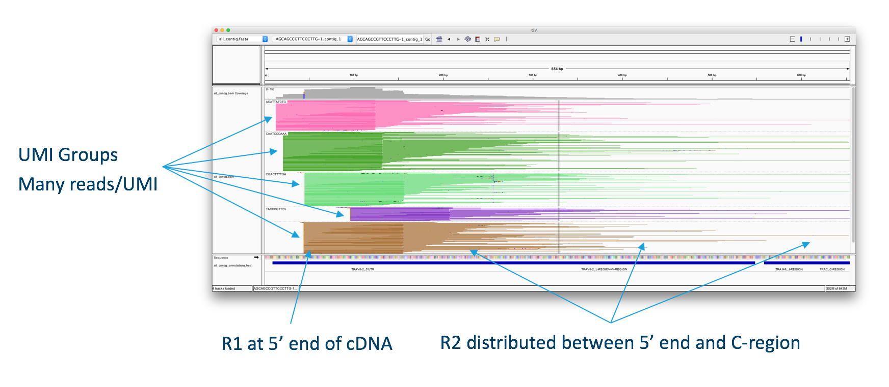

Login to tadpole and navigate to your directory on the share space.

```bash
mkdir -p /share/workshop/adv_scrnaseq/$USER
cd /share/workshop/adv_scrnaseq/$USER

srun -t 1-00:00:00 -c 4 -n 1 --mem 16000 --partition production --account adv_scrna_workshop --reservation adv_scrna_workshop  --pty /bin/bash
```

# Immune profiling V(D)J and B Cells analysis with 10X

Human samples and Human strains of types C57BL/6 and BALB/c have been tested within the 10X genomics system. If you use another Human strain or different organism, then you need to create your own primers and reference sequence.

<div class="figure" style="text-align: center">

<p class="caption">The V(D)J Algorithm</p>
</div>

First V(D)J read-pairs aligned to an assembled contig, illustrating the structure of the read data. One to many UMIs are captured for each V(D)J chain. A round of enrichment PCR targeting the 5′ end to the C-region, followed by enzymatic fragmentation results in a pool of molecules originating from the same transcript. The molecules carry the same 10x barcode and UMI sequences, but with different insert lengths, resulting in different R2 start points. The diversity of R2 start points gives complete coverage of the targeted portion of each transcript, which is typically ~650bp.

Recommended sequencing depth is ~5,000 reads per cell. This is 1/4 the number of reads recommennded for gene expression.

### Test dataset

Workshop dataset we'll be using is from the a recent experiment conducted at UCD of recovered Covid patients.

```bash
mkdir -p /share/workshop/adv_scrnaseq/$USER/scrnaseq_processing
cd /share/workshop/adv_scrnaseq/$USER/scrnaseq_processing
mkdir cd /share/workshop/adv_scrnaseq/$USER/scrnaseq_processing/cellranger_vdj
cd /share/workshop/adv_scrnaseq/$USER/scrnaseq_processing/cellranger_vdj
ln -s /share/workshop/intro_scrnaseq/raw_data/00-SmRawData 00-RawData
```

### Lets buld a reference for Human based on Ensembl release-100 VDJ entries

First lets setup a References folder for our experiment.
```bash
mkdir -p /share/workshop/adv_scrnaseq/$USER/scrnaseq_processing/reference
cd /share/workshop/adv_scrnaseq/$USER/scrnaseq_processing/reference
```

We should already have the needed genome and gtf file for Human Ensembl

## 10X Genomics - cellranger vdj

Description of cellranger vdj can be found [here](https://support.10xgenomics.com/single-cell-vdj/software/pipelines/latest/using/vdj)

### Building indexes for cellranger vdj (takes a long time)

10X Genomics provides pre-built references for human and Human vdj regions to use with Cell Ranger. Researchers can make custom references for additional species or add custom vdj sequences of interest to the reference. The following outlines the steps to build a custom vdj reference using the cellranger mkvdjref pipeline and an ensembl genome.

You should already have the Ensembl 100 Human genome and GTF file in the reference folder, however if you don't, you can copy then from here.
```bash
cd /share/workshop/adv_scrnaseq/$USER/scrnaseq_processing/reference

curl http://ftp.ensembl.org/pub/release-103/fasta/homo_sapiens/dna/Homo_sapiens.GRCh38.dna.primary_assembly.fa.gz --output Homo_sapiens.GRCh38.dna.primary_assembly.fa.gz
gunzip Homo_sapiens.GRCh38.dna.primary_assembly.fa.gz

curl http://ftp.ensembl.org/pub/release-103/gtf/homo_sapiens/Homo_sapiens.GRCh38.103.gtf.gz Homo_sapiens.GRCh38.103.gtf.gz
gunzip Homo_sapiens.GRCh38.103.gtf.gz
```

Running cellranger mkvdjref

```bash
cd /share/workshop/adv_scrnaseq/$USER/scrnaseq_processing/reference

export PATH=/share/workshop/intro_scrnaseq/software/cellranger-6.0.0/bin:$PATH

cellranger mkvdjref \
   --genome=GRCh38.cellranger_vdj \
   --fasta=Homo_sapiens.GRCh38.dna.primary_assembly.fa \
   --genes=Homo_sapiens.GRCh38.103.gtf \
   --ref-version=6.0.0
```

This assumes that the following biotypes are present in the gtf files

* TR_C_gene
* TR_D_gene
* TR_J_gene
* TR_V_gene
* IG_C_gene
* IG_D_gene
* IG_J_gene
* IG_V_gene

You can also generate vdj references for IMGT sequences. Additional instructions for building VDJ references can be found [here](https://support.10xgenomics.com/single-cell-vdj/software/pipelines/latest/advanced/references)


### Running the V(D)J piepline

For this we'll use the [vdj reference](https://support.10xgenomics.com/single-cell-vdj/software/downloads/latest) from 10X

```bash
cd /share/workshop/adv_scrnaseq/$USER/scrnaseq_processing/cellranger_vdj

export PATH=/share/workshop/intro_scrnaseq/software/cellranger-6.0.0/bin:$PATH

cellranger vdj \
    --id=PBMC2sm_VDJ \
    --fastqs=00-RawData \
    --sample=PBMC2sm_VDJ \
    --reference=/share/workshop/intro_scrnaseq/software/refdata-cellranger-vdj-GRCh38-alts-ensembl-5.0.0

cellranger count \
    --id=PBMC2sm \
    --fastqs=00-RawData \
    --sample=PBMC2sm \
    --transcriptome=/share/workshop/intro_scrnaseq/software/refdata-gex-GRCh38-2020-A
```

#### The V(D)J pipeline outputs alot of files

the output contains
* web_summary.html - similar to gene expression
* metrics_summary.csv - similar to gene expression
* annotation CSV/JSONs - filtered_contig_annotations.csv, clonotypes.csv
* FASTQ/FASTAs  - filtered_contig.fasta/filtered_contig.fastq
* barcoded BAMs - consensus alignment mapping files
* cell_barcodes.json - barcodes which are identified as targeted cells.

### Challenge: Cellranger 6.0 Multi

The new [multi](https://support.10xgenomics.com/single-cell-gene-expression/software/pipelines/latest/using/multi) application in Cellranger 6.0 run simultaneous expression and VDJ analysis. Create a config file using the references found in

```
/share/workshop/intro_scrnaseq/software/
```

and run the multi pipeline.


**Once complete** compare the output of multi to the output of counts + vdj

Can use the expression data found here

```
/share/workshop/intro_scrnaseq/raw_data/PBMC2sm
```

**OR** use my completed runs from a full sample

```
/share/workshop/intro_scrnaseq/raw_data/T022PBMC
/share/workshop/intro_scrnaseq/raw_data/T022PBMC_Counts
/share/workshop/intro_scrnaseq/raw_data/T022PBMC_VJD
```
